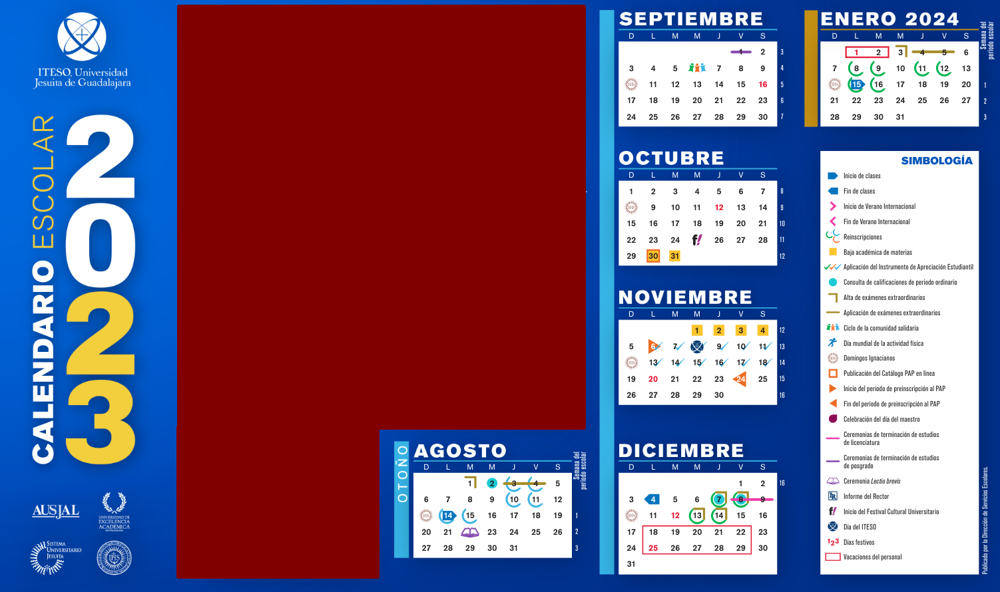

# Calendario de Análisis Estadístico Multivariado

| Semana | Sesión | Fecha            | Contenido                                                          | Anotaciones                                 |
| ------ | ------ | ---------------- | ------------------------------------------------------------------ | ------------------------------------------- |
| 1      | 1      | 19 de agosto     | Encuadre del curso                                                 |                                             |
|        | 2      | 21 de agosto     | Variables + Análisis estadístico exploratorio                      |                                             |
| 2      | 3      | 26 de agosto     | Correlaciones y covarianzas                                        |                                             |
|        | 4      | 28 de agosto     | Correlaciones y covarianzas+Funciones de Distribución y Densidad   |                                             |
| 3      | 5      | 2 de septiembre  | Funciones de Distribución y Densidad                               |                                             |
|        | 6      | 4 de septiembre  | Funciones de Distribución y Densidad                               |                                             |
| 4      | 7      | 9 de septiembre  | Máxima Verosimilitud                                               |                                             |
|        | 8      | 11 de septiembre | Máxima Verosimilitud                                               |                                             |
| 5      | 9      | 18 de septiembre | Razón de Verosimilitud                                             |                                             |
|        | 10     | 23 de septiembre | Razón de Verosimilitud                                             |                                             |
| 6      | 11     | 25 de septiembre | Primer Examen Parcial_Parte 1                                      | Aplicar en una sesión                       |
|        | 12     | 30 de septiembre | Primer Examen Parcial_Parte 2                                      |                                             |
| 7      | 13     | 2 de octubre     | Prueba de Hipótesis Lineal                                         |                                             |
|        | 14     | 7 de octubre     | Prueba de Hipótesis Lineal                                         |                                             |
| 8      | 15     | 9 de octubre     | Regresión Lineal                                                   |                                             |
|        | 16     | 14 de octubre    | Regresión Lineal                                                   |                                             |
| 9      | 17     | 16 de octubre    | **Exposición Regresión Logística**                                 | La exposición se puede alargar a dos clases |
|        | 18     | 21 de octubre    | ANOVA/MANOVA                                                       |                                             |
| 10     | 19     | 23 de octubre    | ANOVA/MANOVA                                                       |                                             |
|        | 20     | 28 de octubre    | Exposición ANCOVA/MANCOVA                                          | La exposición se puede alargar a dos clases |
| 11     | 21     | 30 de octubre    | Segundo Examen Parcial_Parte 1                                     | Aplicar en una sesión                       |
|        | 22     | 4 de noviembre   | Segundo Examen Parcial_Parte 2                                     | **Semana de Bajas**                         |
| 12     | 23     | 6 de noviembre   | Análisis de Componentes Principales                                |                         |
|        | 24     | 11 de noviembre  | Análisis de Componentes Principales                                |                                             |
| 13     | 25     | 13 de noviembre  | **Exposición Análisis Factorial**                                  | La exposición se puede alargar a dos clases |
|        | 26     | 18 de noviembre  | Análisis de clúster                                                |                                             |
| 14     | 27     | 20 de noviembre  | Análisis de clúster                                                |                                             |
|        | 28     | 25 de noviembre  | **Exposición DBScan**                                              | La exposición se puede alargar a dos clases |
| 15     | 29     | 27 de noviembre  | **Exposición GMM**                                                 | La exposición se puede alargar a dos clases |
|        | 30     | 2 de diciembre   | Proyecto Final                                                     |                                             |
| 16     | 31     | 4 de diciembre   | Proyecto Final                                                     |                                             |
|        | 32     | 8 de diciembre   | Calificaciones y firma de Acta                                     |                                             |

## Calendario de ITESO para O-2023

<figure>

  

</figure>
